# EcoMatch — AI Eşleştirme Mikroservisi

> **Bir fabrikanın atığı, diğerinin hammaddesidir.**

Bu depo, DöngüNet endüstriyel simbiyoz platformunun yapay zekâ mikroservisini içerir: atık ilanlarını hammadde taleplerine anlamsal (semantic) olarak eşleştiren, atıkları kategorilere sınıflandıran SBERT tabanlı bir servis.

Aşağıdaki bölüm, servisin **v1'den v9'a kadar olan geliştirme sürecini ölçüm verileriyle** belgeler. Her sürümde ne değişti, hangi noktada sistem patladı, nasıl teşhis edildi ve nasıl çözüldü — hepsi `docs/tests/` altındaki test grafikleriyle desteklenmiştir.

---

## Teknik Özet

| Bileşen | Seçim |
|---|---|
| Embedding modeli | `sentence-transformers/all-mpnet-base-v2` (768D) |
| Eşleştirme modeli | Alan-özel fine-tuned model (`./fine_tuned_model`) |
| Sınıflandırma modeli | Orijinal (fine-tune edilmemiş) model |
| Eğitim | 602 satırlık alan veri seti, `CosineSimilarityLoss` |
| Arama | Hibrit: BM25 + kosinüs benzerliği (alpha = 0.1) |
| Vektör deposu | PostgreSQL 16 + pgvector (`vector(768)`) |
| Servis | Python 3.11 + FastAPI, stateless mikroservis |
| Eşik | Kosinüs benzerlik eşiği = 0.49 (optimal) |

**Test seti:** 212 eşleştirme çifti (85 pozitif, 102 negatif, 25 sınırda) + 140 örneklik sınıflandırma seti (7 kategori) + 5 grup edge case.

---

## Güncel Performans (v9)

| Metrik | Değer |
|---|---|
| Optimal eşikte F1 | **0.883** |
| Pozitif eşleştirme ort. skor | **0.7351** |
| Negatif eşleştirme ort. skor | **0.0600** |
| Yanlış pozitif oranı | **%5.9** |
| Sınıflandırma doğruluğu (toplam) | **%76.4** |
| — normal ifadeler | %92.9 |
| — karma içerik | %92.9 |
| — kısa metin | %82.1 |

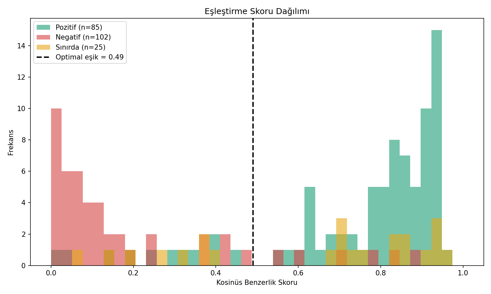
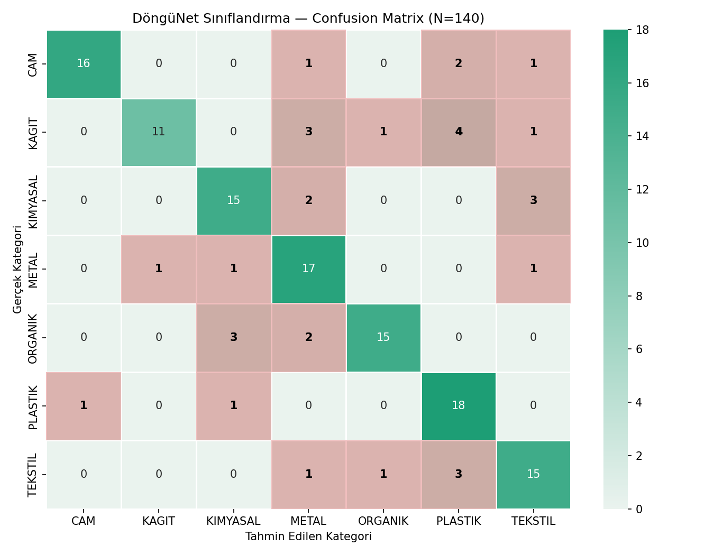

---

# Geliştirme Günlüğü — Adım Adım

## v1 — Temel çizgi (baseline): sistem çalışıyor ama ayırt etmiyor

Hazır `all-mpnet-base-v2` modeli, hiçbir uyarlama yapılmadan doğrudan kullanıldı.

**Sonuç:**

| Metrik | v1 |
|---|---|
| Sınıflandırma doğruluğu | %45.0 |
| Pozitif ort. skor | 0.5238 |
| Negatif ort. skor | **0.5499** |
| Yanlış pozitif oranı | %71.6 |
| F1 (optimal eşik 0.45) | 0.530 |

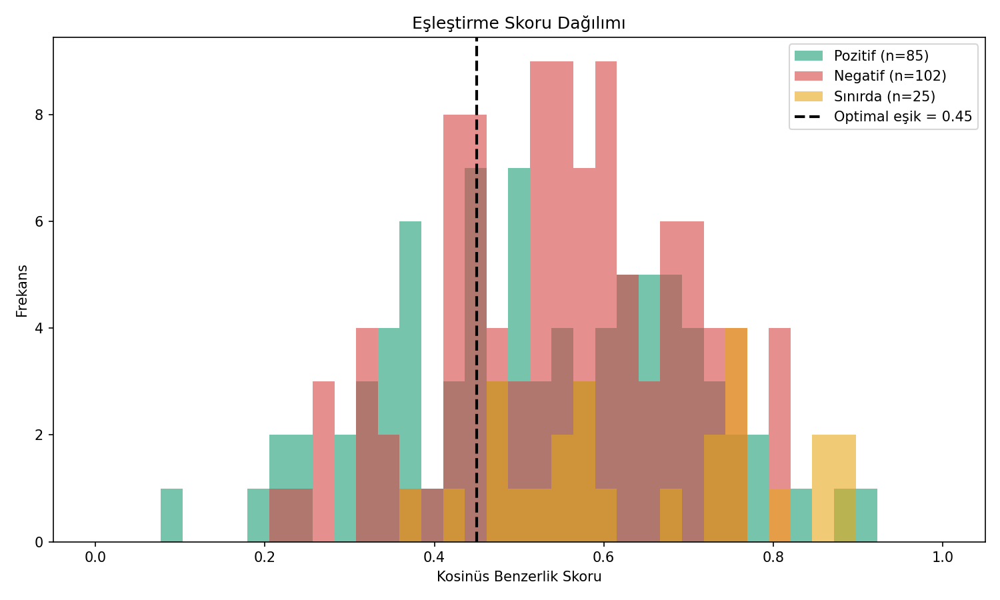

### Nerede patladı

**Negatif çiftlerin ortalama skoru pozitiflerden yüksek çıktı (0.5499 > 0.5238).** Yani model, alakasız atık–hammadde çiftlerini alakalı olanlardan daha "benzer" buluyordu. Histogramda pozitif ve negatif dağılımlar tamamen üst üste biniyor; ayıracak bir eşik değeri fiziksel olarak mevcut değil. Her 10 eşleşmenin 7'si hatalıydı (FP %71.6).

### Teşhis

Genel amaçlı bir cümle modeli, "hurda alüminyum talaşı" ile "atık kâğıt balyası" arasındaki endüstriyel farkı bilmiyor; her ikisini de "sanayi/atık" konseptine yakın gömüyor. Kosinüs skorları 0.4–0.7 bandında sıkışıyor — klasik embedding anizotropisi. Bu bir eşik ayarı problemi değil, **temsil (representation) problemi**.

---

## v2 — Sınıflandırma tarafının düzeltilmesi

Kategori tanımları zenginleştirildi ve sınıflandırma prompt/etiket katmanı yeniden yazıldı.

| Metrik | v1 | v2 |
|---|---|---|
| Sınıflandırma doğruluğu | %45.0 | **%66.4** |
| — normal ifadeler | %42.9 | %85.7 |
| — karma içerik | %42.9 | %78.6 |
| — yazım hatalı | %57.1 | %78.6 |
| Eşleştirme F1 | 0.530 | 0.530 *(değişmedi)* |

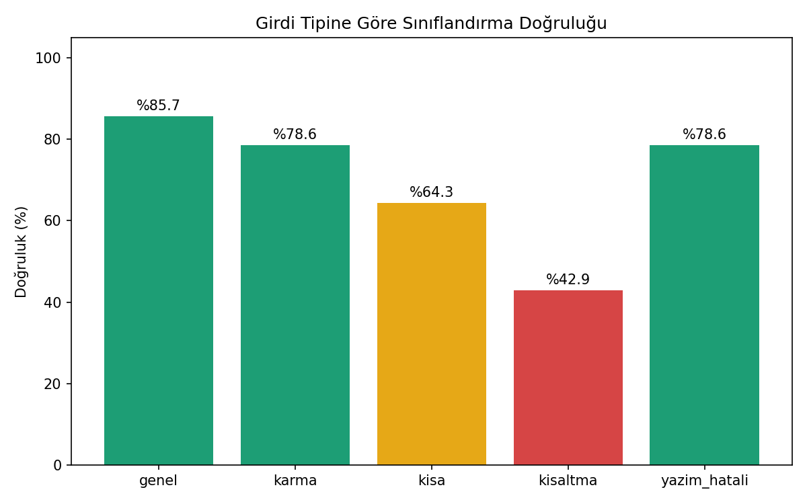

Sınıflandırma 21 puan arttı. **Eşleştirme metrikleri kıl payı bile oynamadı** — beklenen davranış, çünkü değişiklik embedding üretimine dokunmuyordu.

---

## v3 — Regresyon doğrulaması

v3 metrikleri v2 ile **birebir aynı** çıktı (%66.4 / 0.5238 / 0.5499 / F1 0.530).

Bu bilinçli bir kontroldü: test harness'ının deterministik olduğunu ve aynı girdide aynı sonucu verdiğini kanıtlamak. Buradan sonraki her metrik değişimi gerçek bir model değişimine atfedilebilir hale geldi.

> **Ders:** Bir değişiklik yaptıktan sonra metrik hiç oynamıyorsa, iki ihtimal vardır — ya değişiklik o yola hiç dokunmuyordur ya da kod gerçekten devreye girmemiştir. İkisini ayırt edebilmek için önce harness'ın tekrarlanabilirliği kanıtlanmalıdır. (Bu ders v5'te işimize yarayacak.)

---

## v4 — Fine-tuning: kök problemin çözümü

602 satırlık alan-özel atık/hammadde veri setiyle `CosineSimilarityLoss` kullanılarak model fine-tune edildi. Bu sürüm servise entegre edilmeden, **izole bir A/B ölçümü** olarak koşuldu.

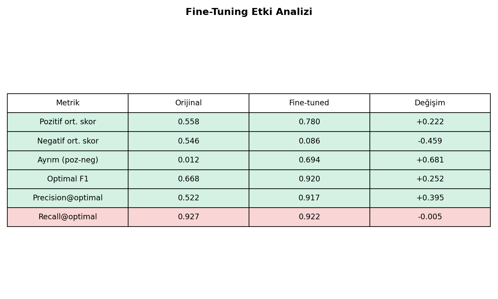

| Metrik | Orijinal | Fine-tuned | Değişim |
|---|---|---|---|
| Pozitif ort. skor | 0.558 | 0.780 | +0.222 |
| Negatif ort. skor | 0.546 | 0.086 | **−0.459** |
| Ayrım (poz − neg) | 0.012 | **0.694** | +0.681 |
| Optimal F1 | 0.668 | 0.920 | +0.252 |
| Precision@optimal | 0.522 | 0.917 | +0.395 |
| Recall@optimal | 0.927 | 0.922 | −0.005 |

Pozitif–negatif ayrımı 0.012'den 0.694'e çıktı. Precision neredeyse iki katına çıkarken recall'dan yalnızca 0.005 verildi — yani model "daha seçici" olurken doğru eşleşmeleri kaçırmaya başlamadı. v1'in kök nedeni bu adımda çözüldü.

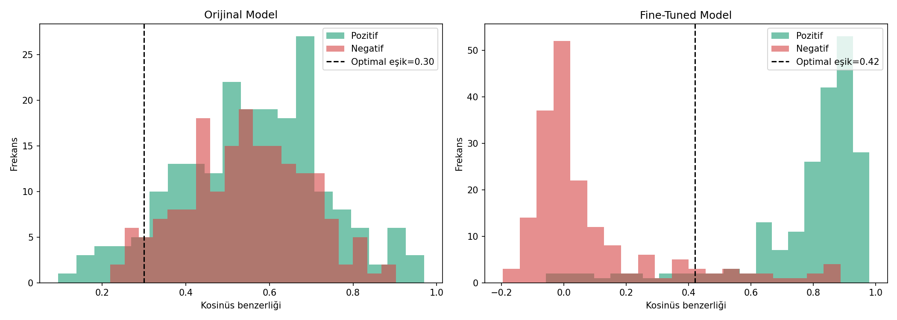
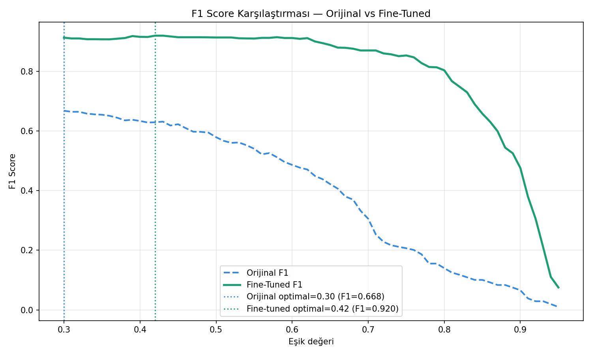

---

## v5 — Sessiz hata: model bağlandı sanıldı, bağlanmamıştı

Fine-tuned model servise entegre edildi, testler yeniden koşuldu. Rapor başlığı **"DöngüNet SBERT (Fine-Tuned)"** olarak güncellendi.

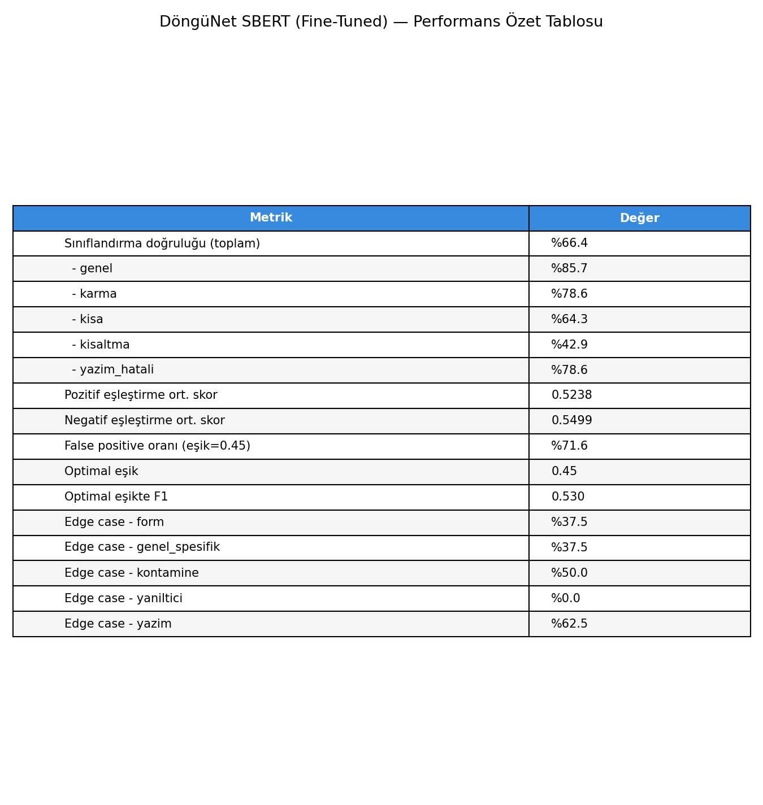

### Nerede patladı

Başlık değişti, **sayılar değişmedi.** v5 özet tablosu v2/v3 ile birebir aynıydı:

| Metrik | v3 | v5 (fine-tuned iddiası) | v4'te ölçülen gerçek |
|---|---|---|---|
| Pozitif ort. skor | 0.5238 | 0.5238 | 0.780 |
| Negatif ort. skor | 0.5499 | 0.5499 | 0.086 |
| Optimal eşik | 0.45 | 0.45 | ~0.49 |
| FP oranı | %71.6 | %71.6 | — |

v4 izole testi modelin 0.694'lük bir ayrım ürettiğini kanıtlamıştı. Servis hâlâ 0.012'lik ayrım raporluyordu. **Servis fine-tuned modeli hiç yüklememişti** — model yolu çözülmüyor, sessizce orijinal hub modeline düşülüyordu. Hiçbir hata fırlamadığı için sorun ancak metrik karşılaştırmasıyla yakalandı.

### Çözüm

1. Model yükleme aşamasına **fail-fast** kontrolü eklendi: `./fine_tuned_model` yoksa servis açılışta patlar, sessizce fallback yapmaz.
2. Servis açılışında yüklenen model kimliği ve embedding boyutu loglanır.
3. Test çıktısına **sağlık kontrolü (sanity check)** eklendi: bilinen bir pozitif çift 0.70'in altında skorlarsa test başarısız sayılır.

> **Ders:** Bir rapor başlığı, o raporu üreten kodun gerçekten yeni modeli kullandığının kanıtı değildir. Doğrulama, çıktının kendisinden gelmeli.

---

## v6 — Fine-tuned model gerçekten devrede, bu sefer sınıflandırma çöktü

| Metrik | v5 (sahte) | v6 (gerçek) |
|---|---|---|
| Pozitif ort. skor | 0.5238 | **0.7351** |
| Negatif ort. skor | 0.5499 | **0.0600** |
| FP oranı | %71.6 | **%5.9** |
| Optimal eşik | 0.45 | 0.49 |
| F1 | 0.530 | **0.883** |
| **Sınıflandırma doğruluğu** | %66.4 | **%52.1** ⚠️ |


### Nerede patladı

Eşleştirme tarafı hedefe ulaştı: yanlış pozitif oranı %71.6'dan %5.9'a düştü, F1 0.883'e çıktı. Ama **sınıflandırma doğruluğu %66.4'ten %52.1'e çöktü** — v2'nin de altına indi.

### Teşhis

Tek bir model hem eşleştirme hem sınıflandırma için kullanılıyordu. Fine-tuning, embedding uzayını "bu iki metin ticari olarak eşleşir mi?" sorusuna göre yeniden şekillendirdi. Bu, kategori ayrımı için gereken bilgiyi kısmen yok etti: fine-tuned uzayda "PET şişe kırığı" ile "polipropilen granül" birbirine çok yakın (ikisi de plastik akışı, eşleşebilir), ama sınıflandırma bunları ayırt etmek zorunda. Klasik **catastrophic forgetting / alan daralması**.

---

## v7 — İki-model mimarisi (mevcut mimari kararı)

Tek modelle iki farklı görevi optimize etmeye çalışmak yerine görevler ayrıldı:

```
                ┌──────────────────────────────┐
  Atık ilanı ──▶│ Orijinal all-mpnet-base-v2   │──▶ Kategori (7 sınıf)
                └──────────────────────────────┘
                ┌──────────────────────────────┐
  Sorgu      ──▶│ Fine-tuned model + BM25      │──▶ Eşleşme skoru
                │ (hibrit, alpha=0.1)          │
                └──────────────────────────────┘
```

| Metrik | v6 | v7 |
|---|---|---|
| Sınıflandırma doğruluğu | %52.1 | **%76.4** |
| — normal ifadeler | %50.0 | %92.9 |
| — karma içerik | %67.9 | %92.9 |
| — kısa metin | %46.4 | %82.1 |
| Eşleştirme F1 | 0.883 | 0.883 *(korundu)* |
| FP oranı | %5.9 | %5.9 *(korundu)* |

Her iki görev de aynı anda en iyi haline geldi. Bellek maliyeti iki model (~840 MB), buna karşılık 24 puanlık sınıflandırma kazancı — kabul edildi.

### Hibrit ağırlık kalibrasyonu (alpha)

Aynı sürümde BM25 ağırlığı taranarak ölçüldü:

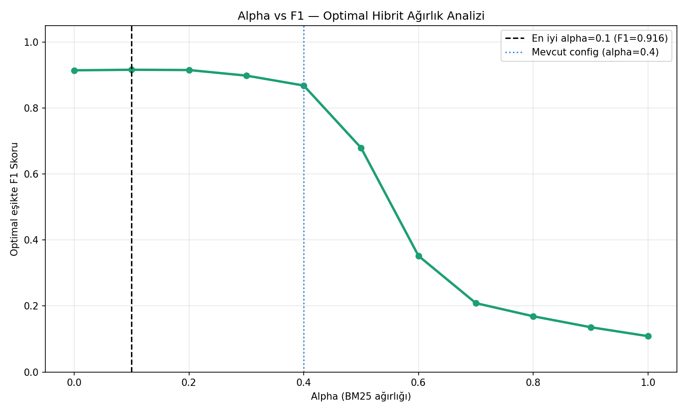

| alpha (BM25 ağırlığı) | F1 |
|---|---|
| 0.0 | 0.912 |
| **0.1** | **0.916** ← seçilen |
| 0.2 | 0.915 |
| 0.3 | 0.897 |
| 0.4 *(eski config)* | 0.866 |
| 0.6 | 0.351 |
| 1.0 (saf BM25) | 0.108 |

Fine-tuning sonrası semantik sinyal o kadar güçlendi ki, BM25'e verilen her ağırlık artık zarar veriyor. alpha **0.4 → 0.1** olarak güncellendi (+0.05 F1). Saf BM25'in 0.108'e çökmesi, anahtar kelime aramasının bu alanda neden yetersiz kaldığının doğrudan kanıtı.

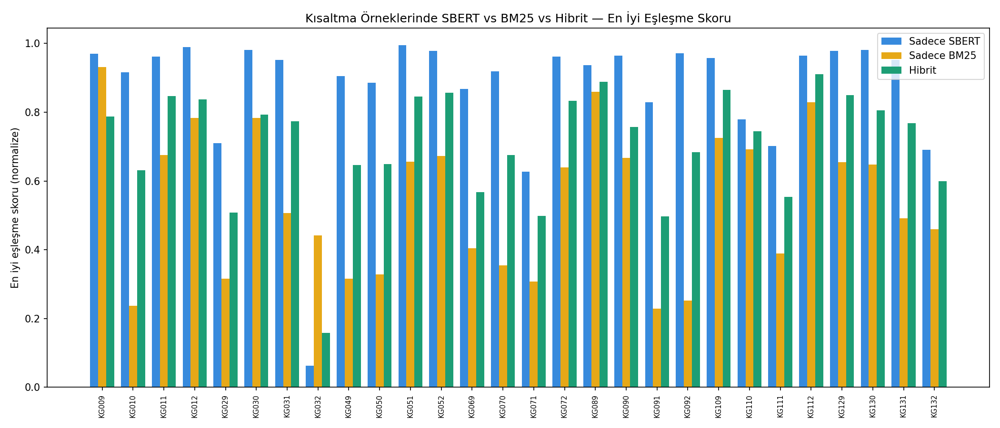

BM25 kısaltmalarda (KG032 gibi) tek başına tamamen başarısız; hibrit ise neredeyse her örnekte saf SBERT'in altında kalıyor. BM25 tamamen kaldırılmadı çünkü kimyasal kod ve CAS numarası gibi tam eşleşme gerektiren durumlarda hâlâ değerli — ama ağırlığı minimuma çekildi.

---

## v8 — Sunum ve dokümantasyon grafikleri

Jüri sunumu için ölçüm verilerinden türetilmiş grafik seti üretildi: sistem mimarisi, veri pipeline'ı, öncesi/sonrası karşılaştırma, sınıflandırma performansı, eşik analizi ve teknoloji yığını.

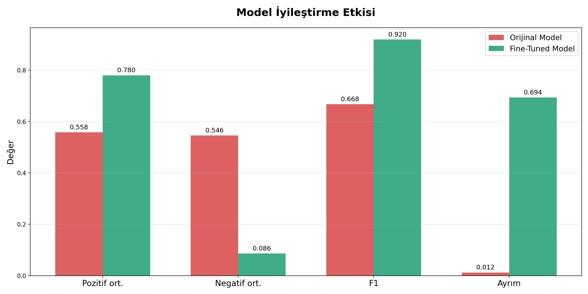
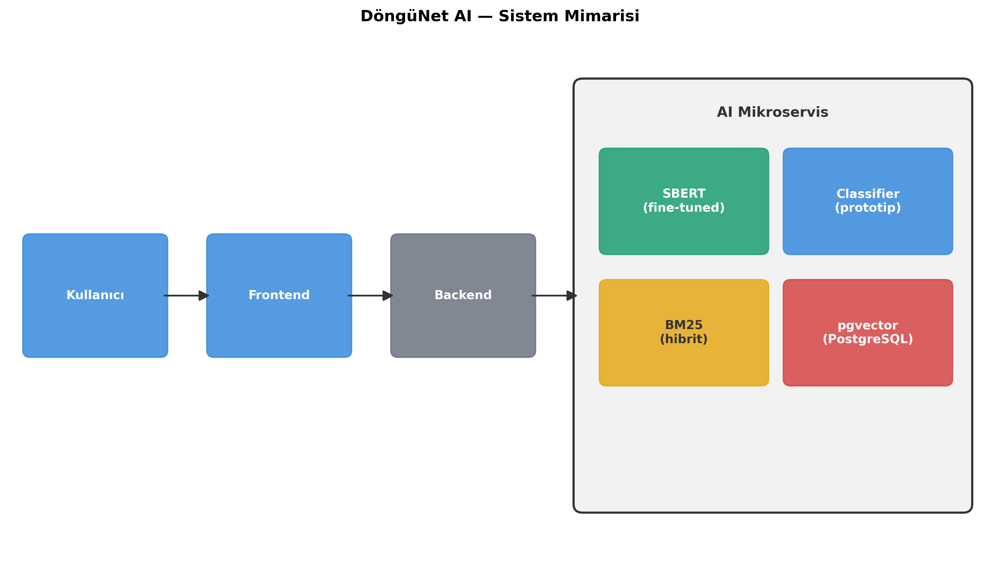
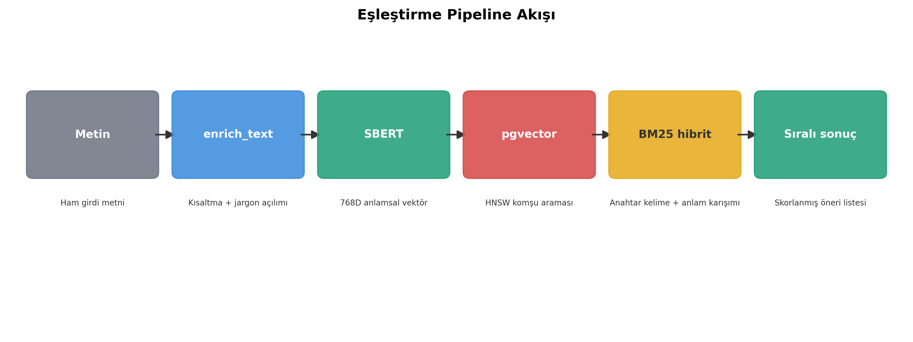

Model kodunda değişiklik yok.

---

## v9 — Son doğrulama

Tüm test seti ve sunum grafikleri birlikte yeniden koşuldu. v7 metrikleri birebir korundu (%76.4 / F1 0.883 / FP %5.9) — **regresyon yok**. Mevcut sürüm budur.

---

## Sürüm Metrik Tablosu

| Sürüm | Sınıflandırma | Poz. skor | Neg. skor | FP oranı | F1 | Notu |
|---|---|---|---|---|---|---|
| v1 | %45.0 | 0.5238 | 0.5499 | %71.6 | 0.530 | Baseline — ayrım yok |
| v2 | %66.4 | 0.5238 | 0.5499 | %71.6 | 0.530 | Sınıflandırma düzeltildi |
| v3 | %66.4 | 0.5238 | 0.5499 | %71.6 | 0.530 | Regresyon doğrulaması |
| v4 | — | 0.780 | 0.086 | — | 0.920 | Fine-tune izole testi |
| v5 | %66.4 | 0.5238 | 0.5499 | %71.6 | 0.530 | ⚠️ Model yüklenmemiş |
| v6 | %52.1 | 0.7351 | 0.0600 | %5.9 | 0.883 | ⚠️ Sınıflandırma çöktü |
| v7 | %76.4 | 0.7351 | 0.0600 | %5.9 | 0.883 | İki-model mimarisi |
| v8 | %76.4 | 0.7351 | 0.0600 | %5.9 | 0.883 | Sunum grafikleri |
| **v9** | **%76.4** | **0.7351** | **0.0600** | **%5.9** | **0.883** | Son doğrulama |

---

## Bilinen Zayıf Noktalar

Testler yalnızca başarıyı değil, sınırları da belgeliyor.

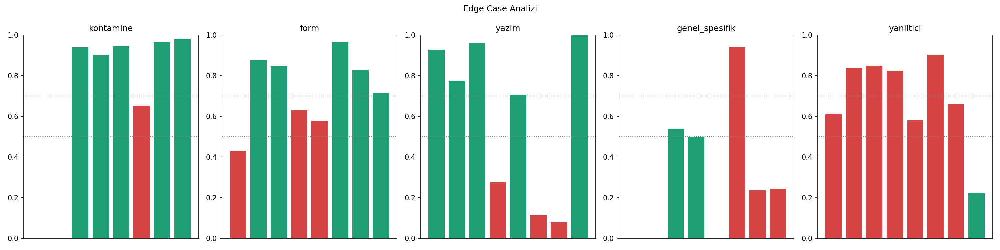
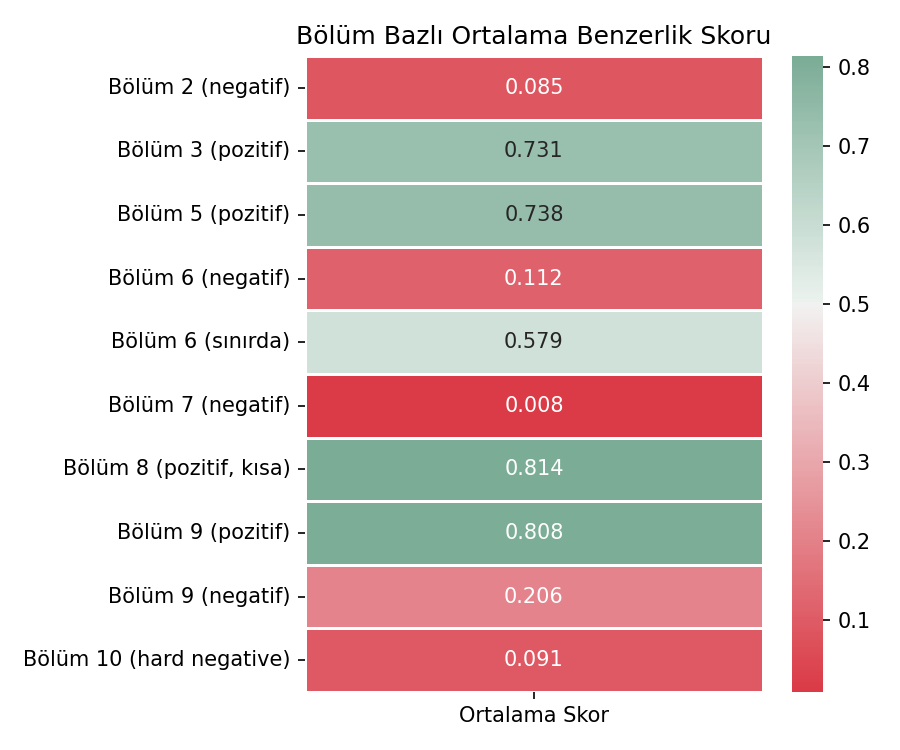

| Alan | Skor | Sorun |
|---|---|---|
| Kısaltmalar | %46.4 | "PE-HD", "ATY", "HM" gibi sektör kısaltmaları çözülemiyor — v1'den beri en az iyileşen boyut |
| Yanıltıcı çiftler | %12.5 | Yüzeysel olarak benzer ama endüstriyel olarak eşleşmeyen çiftler (ör. gıda yağı vs. makine yağı) hâlâ yüksek skor alıyor |
| Genel/spesifik ayrımı | %25.0 | "plastik atık" gibi genel bir ilan, spesifik bir talebe fazla iyimser eşleşiyor |
| Sınırda örnekler | 0.579 | Eşiğe (0.49) çok yakın — küçük veri kayması yanlış tarafa düşürebilir |
| Bölüm 9 negatifleri | 0.206 | Diğer negatif bölümlerin (0.008–0.112) belirgin üstünde |

Kontamine ve yazım hatalı girdilerde ise sistem sağlam: %62.5 doğru, tipik gerçek dünya kullanıcı girdisini tolere ediyor.

---

## Yol Haritası

**Kısa vade**
- [ ] **Kısaltma normalizasyon katmanı** — embedding öncesi sektör sözlüğüyle açma (PE-HD → yüksek yoğunluklu polietilen). En büyük tekil kazanç burada.
- [ ] **Hard negative madenciliği ile 2. tur fine-tune** — yanıltıcı çiftler (%12.5) ve Bölüm 9 negatifleri doğrudan eğitim setine eklenecek.
- [ ] Genel/spesifik asimetrisi için ilan detay seviyesine göre skor cezası.

**Orta vade**
- [ ] **AHP tabanlı ağırlık kalibrasyonu** — ilk 50 gerçek eşleşmeden sonra mesafe, miktar, sertifika ve benzerlik ağırlıkları saha verisiyle kalibre edilecek.
- [ ] Sabit 0.49 eşiğinin kategori bazlı dinamik eşiğe dönüştürülmesi.
- [ ] pgvector HNSW indeksi — OSB ölçeğinde arama gecikmesi için.

**Uzun vade**
- [ ] Karbon kredisi sertifikasyon modülü
- [ ] AB Dijital Ürün Pasaportu (DPP) ve CBAM uyum katmanı
- [ ] Opsiyonel IoT/MQTT entegrasyonu (şu an birincil veri kaynağı manuel giriş)

---

## Test Grafiklerinin Dizini

```
docs/tests/
├── 1/ … 3/   # baseline ve sınıflandırma iyileştirmesi
│   ├── test_g1_siniflandirma.png      # confusion matrix
│   ├── test_g2_siniflandirma_tip.png  # ifade tipine göre doğruluk
│   ├── test_g3_skor_dagilimi.png      # poz/neg skor histogramı
│   ├── test_g4_esik_analizi.png       # eşik–F1 eğrisi
│   ├── test_g5_edge_cases.png         # edge case analizi
│   └── test_g6_ozet_tablo.png         # özet metrik tablosu
├── 4/        # fine-tuning izole A/B testi
├── 5/ … 7/   # entegrasyon, iki-model mimarisi (+ g7 hibrit, g8 bölüm, g9 alpha)
├── 8/        # sunum grafikleri
└── 9/        # son sürüm — test + sunum
```

---

*TEKNOFEST 2026 Sıfır Atık & Döngüsel Ekonomi · Takım: VectorMatch · Takım ID #1003771
