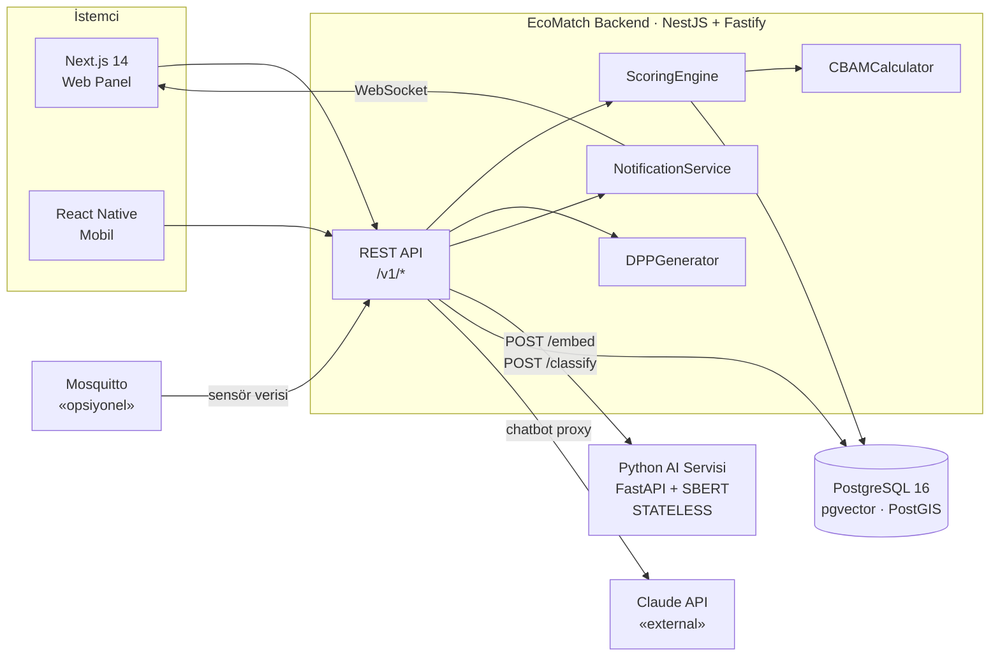
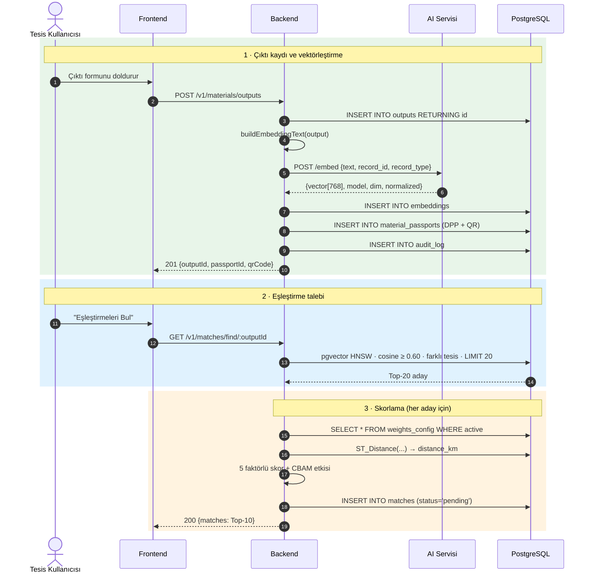

# 02 · Mimari

## Servis topolojisi

Üç çalışan parça var. Aralarındaki tek bağ HTTP; ortak veritabanı, ortak kod, ortak
deploy yok.



## Kim neyi yazıyor

Bu ayrım keskin. Bir tarafın diğerinin dosyasına dokunması, sözleşme tartışması
açılmadan yapılmaz.

| Parça | Sahibi | Repo | Durum |
|---|---|---|---|
| **Backend (NestJS)** | Bu repo | `backend/` | Auth bitti, gerisi Faz 0'dan itibaren |
| **AI mikroservisi** | Takım arkadaşı | ayrı | Sözleşme: [07-ai-entegrasyonu.md](07-ai-entegrasyonu.md) |
| **Web + Mobil** | Frontend | ayrı | Sözleşme: [04-api-sozlesmesi.md](04-api-sozlesmesi.md) |

Sınırların tek gerçek kaynağı yukarıdaki sözleşme dokümanlarıdır. "Ben şöyle döndürüyorum" diye
sözlü anlaşma yapılmaz; önce sözleşme güncellenir, sonra iki taraf ona göre yazar.

## Neden bu bölünme

**AI servisi neden ayrı ve neden stateless?**

Python tarafı sadece iki şey yapıyor: metni vektöre çeviriyor, metni sınıflandırıyor.
Hiçbir şey saklamıyor, hiçbir şey aramıyor. Sebebi teknik bir tarih: erken versiyonda
AI servisinin kendi in-memory vektör deposu vardı, `record_id`'yi integer tutuyordu,
backend ise UUID gönderiyordu. Tip uyuşmazlığı sessizce bozuk indeks üretiyordu.

Çözüm, saklama sorumluluğunu tamamen backend'e vermek oldu. AI servisi vektörü döndürür,
`embeddings` tablosuna yazan backend'dir. Böylece:

- Tip uyuşmazlığı yapısal olarak imkânsız hâle geldi
- AI servisi yatay ölçeklenebilir (durum tutmuyor)
- AI servisi çöktüğünde veri kaybı olmuyor, sadece embedding gecikiyor
- Vektör araması zaten pgvector'ün işi; ikinci bir arama motoru gereksiz

`record_id` alanı hâlâ istekte gönderiliyor ama **sadece log/trace amaçlı** — AI servisi
onunla iş yapmaz.

**Neden PostgreSQL, ayrı bir vektör veritabanı değil?**

Eşleştirme sorgusu aynı anda üç şeye ihtiyaç duyuyor: vektör benzerliği, coğrafi mesafe,
ilişkisel filtre (aynı tesis olmasın, tesis doğrulanmış olsun, stok yeterli olsun).
pgvector + PostGIS bunu tek sorguda veriyor. Ayrı bir vektör DB'si, her aday için ikinci
bir round-trip ve tutarlılık derdi demek.

## Backend iç yapısı

```
backend/src/
├── main.ts                    Fastify bootstrap, ValidationPipe, Swagger
├── app.module.ts              Kök modül — her yeni modül buraya kaydedilir
├── prisma/
│   ├── prisma.module.ts       @Global — her yerde inject edilebilir
│   └── prisma.service.ts      PrismaClient yaşam döngüsü
├── common/
│   ├── guards/                JwtAuthGuard · RolesGuard · VerifiedFacilityGuard
│   ├── decorators/            @GetUser · @Roles
│   ├── interceptors/          AuditInterceptor
│   └── filters/               HttpExceptionFilter (ortak hata formatı)
├── config/                    system_config okuma, tipli ayar erişimi
├── docs/                      OpenAPI YAML parçaları (auth.yml, ...)
└── modules/
    ├── auth/                  kayıt, giriş, profil  (hazır)
    ├── facilities/            tesis profili, doğrulama, belge yükleme
    ├── materials/             input/output CRUD, DPP üretimi, QR
    ├── matchmaking/           aday bulma, skorlama, kabul/red, HITL kuyruğu
    ├── reports/               çevresel · CBAM · DPP raporları, PDF
    └── iot/                   MQTT abonesi, sensör verisi (opsiyonel)
```

Her modül aynı iskelete sahip: `*.module.ts`, `*.controller.ts`, `*.service.ts`, `*.dto.ts`.
Referans implementasyon `modules/auth/` — yeni modül yazarken şeklini oradan kopyala.

### Katman sorumlulukları

| Katman | Yapar | Yapmaz |
|---|---|---|
| Controller | Doğrulama, guard, servise devretme | İş kuralı, Prisma çağrısı |
| Service | İş kuralı, transaction, dış servis çağrısı | HTTP detayı bilmez |
| Guard | Kimlik, rol, tesis doğrulama kontrolü | İş kuralı |
| Interceptor | Audit log, response sarmalama | Yetkilendirme |

## Ana veri akışı — çıktı kaydından eşleşmeye

Sequence diyagramının özeti. Detaylı kabul kriterleri
[06-senaryolar.md](06-senaryolar.md) S2 ve S3'te.



Dikkat edilecek iki nokta:

1. **Ağırlıklar her istekte `weights_config` tablosundan okunur.** Kodda sabit değildir —
   admin AHP kalibrasyonu yaptığında yeniden deploy gerekmesin diye.
2. **Embedding yazma işi backend'de.** AI servisi sadece vektörü döndürür.

## Kesişen konular (cross-cutting)

| Konu | Nerede çözülüyor |
|---|---|
| Kimlik | `JwtAuthGuard` — access 1 saat, refresh 30 gün (HttpOnly cookie) |
| Yetki | `RolesGuard` + `@Roles(...)` — rol matrisi [04](04-api-sozlesmesi.md)'te |
| Tesis doğrulama | `VerifiedFacilityGuard` — `facility.verified = false` ise 403 |
| Hata formatı | `HttpExceptionFilter` — tüm hatalar tek şekilde döner |
| Denetim izi | `AuditInterceptor` — her mutasyon `audit_log`'a yazılır |
| Rate limit | Nginx + uygulama katmanı, tablo [04](04-api-sozlesmesi.md)'te |
| Yapılandırma | `system_config` tablosu — eşikler, limitler; deploy gerektirmeden değişir |
| Gerçek zamanlı | WebSocket (Socket.IO) — bildirim push'u |

## Dayanıklılık

AI servisi ve veritabanı düşebilir. Sistem bu durumlarda çökmez, kısıtlı çalışır.
Detay: [07-ai-entegrasyonu.md](07-ai-entegrasyonu.md) ve
[06-senaryolar.md](06-senaryolar.md) H1-H4.

| Bileşen düşerse | Davranış |
|---|---|
| AI servisi | 3 kez retry (500ms/1s/2s) → circuit breaker → çıktı yine kaydedilir, embedding kuyruğa alınır (`embedding_pending = true`) |
| Veritabanı | `/health` fail → 503 + "Sistem geçici bakımda", 500 değil |
| Claude API | Chatbot devre dışı, asistan mesajı DB'ye yazılmaz |
| MQTT | Sensör verisi gelmez, tesis manuel stok güncellemeye döner |

## Çalıştırma ortamı

Docker Compose ile ayağa kalkan servisler: `postgres` (pgvector + postgis eklentileriyle),
`redis` (embedding cache + idempotency + iş kuyruğu), `mosquitto` (opsiyonel),
`ai-service`, `backend`, `frontend`. Nginx önde: SSL sonlandırma + rate limit.

Backend'in tek başına geliştirilmesi için `postgres` ve `redis` yeterlidir; AI servisi
olmadan çalışırken embedding'ler `pending` kalır ve eşleştirme çalışmaz — bu beklenen
davranıştır, hata değil.
