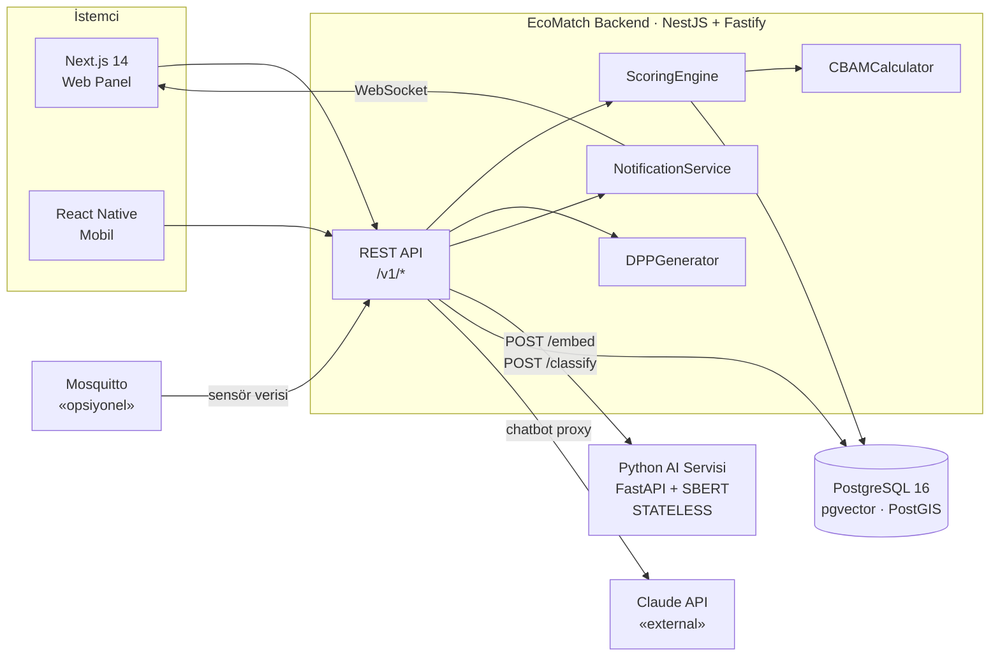
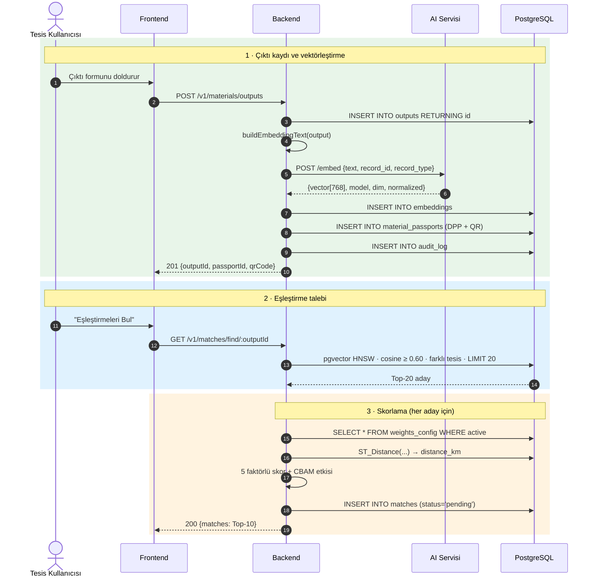

# 02 · Mimari

## Servis topolojisi

Üç çalışan parça var. Aralarındaki tek bağ HTTP; ortak veritabanı, ortak kod, ortak
deploy yok.



## Servis bileşenleri ve mülkiyet

Tüm bileşenler tek bir monorepo altında (`eco-match-application`) toplanmıştır ve kök `docker-compose.yml` ile tek komutta orkestre edilir.

| Parça | Konum | Teknoloji | Durum |
|---|---|---|---|
| **Backend API** | `backend/` | NestJS 10 + Fastify + Prisma 5 | Tamamlandı (Faz 0-3 tüm modüller devrede) |
| **AI Mikroservisi** | `AI Microservice/` | Python 3.12 + FastAPI + SBERT (`all-mpnet-base-v2`) | Tamamlandı (Stateless, model diskte hazır) |
| **Web Arayüzü & Ters Vekil** | `web/` | Next.js 16 + React 19 + Nginx ters vekil | Tamamlandı (SPA + proxy tek origin) |
| **Veritabanı Katmanı** | Docker | PostgreSQL 16 + pgvector + PostGIS | Tamamlandı (HNSW ve uzamsal indeksli) |

Bileşenler arası sınırlar sözleşme dokümanlarıyla [04-api-sozlesmesi.md](04-api-sozlesmesi.md) ve [07-ai-entegrasyonu.md](07-ai-entegrasyonu.md) güvenceye alınmıştır.

## Neden bu bölünme

**AI servisi neden ayrı ve neden stateless?**

Python tarafı sadece iki şey yapıyor: metni vektöre çeviriyor, metni sınıflandırıyor.
Hiçbir şey saklamıyor, hiçbir şey aramıyor. Sebebi teknik bir tarih: erken versiyonda
AI servisinin kendi in-memory vektör deposu vardı, `record_id`'yi integer tutuyordu,
backend ise UUID gönderiyordu. Tip uyuşmazlığı sessizce bozuk indeks üretiyordu.

Çözüm, saklama sorumluluğunu tamamen backend'e vermek oldu. AI servisi vektörü döndürür,
`embeddings` tablosuna yazan backend'dir. Böylece:

- Tip uyuşmazlığı yapısal olarak imkânsız hâle geldi
- AI servisi yatay ölçeklenebilir (durum tutmuyor)
- AI servisi çöktüğünde veri kaybı olmuyor, sadece embedding gecikiyor
- Vektör araması zaten pgvector'ün işi; ikinci bir arama motoru gereksiz

`record_id` alanı hâlâ istekte gönderiliyor ama **sadece log/trace amaçlı** — AI servisi
onunla iş yapmaz.

**Neden PostgreSQL, ayrı bir vektör veritabanı değil?**

Eşleştirme sorgusu aynı anda üç şeye ihtiyaç duyuyor: vektör benzerliği, coğrafi mesafe,
ilişkisel filtre (aynı tesis olmasın, tesis doğrulanmış olsun, stok yeterli olsun).
pgvector + PostGIS bunu tek sorguda veriyor. Ayrı bir vektör DB'si, her aday için ikinci
bir round-trip ve tutarlılık derdi demek.

## Backend iç yapısı

```
backend/src/
├── main.ts                    Fastify bootstrap, ValidationPipe, Swagger
├── app.module.ts              Kök modül — her yeni modül buraya kaydedilir
├── prisma/
│   ├── prisma.module.ts       @Global — her yerde inject edilebilir
│   └── prisma.service.ts      PrismaClient yaşam döngüsü
├── common/
│   ├── guards/                JwtAuthGuard · RolesGuard · VerifiedFacilityGuard
│   ├── decorators/            @GetUser · @Roles
│   ├── interceptors/          AuditInterceptor
│   └── filters/               HttpExceptionFilter (ortak hata formatı)
├── config/                    system_config okuma, tipli ayar erişimi
├── docs/                      OpenAPI YAML parçaları (auth.yml, ...)
└── modules/
    ├── auth/                  kayıt, giriş, profil  (hazır)
    ├── facilities/            tesis profili, doğrulama, belge yükleme
    ├── materials/             input/output CRUD, DPP üretimi, QR
    ├── matchmaking/           aday bulma, skorlama, kabul/red, HITL kuyruğu
    ├── reports/               çevresel · CBAM · DPP raporları, PDF
    └── iot/                   MQTT abonesi, sensör verisi (opsiyonel)
```

Her modül aynı iskelete sahip: `*.module.ts`, `*.controller.ts`, `*.service.ts`, `*.dto.ts`.
Referans implementasyon `modules/auth/` — yeni modül yazarken şeklini oradan kopyala.

### Katman sorumlulukları

| Katman | Yapar | Yapmaz |
|---|---|---|
| Controller | Doğrulama, guard, servise devretme | İş kuralı, Prisma çağrısı |
| Service | İş kuralı, transaction, dış servis çağrısı | HTTP detayı bilmez |
| Guard | Kimlik, rol, tesis doğrulama kontrolü | İş kuralı |
| Interceptor | Audit log, response sarmalama | Yetkilendirme |

## Ana veri akışı — çıktı kaydından eşleşmeye

Sequence diyagramının özeti. Detaylı kabul kriterleri
[06-senaryolar.md](06-senaryolar.md) S2 ve S3'te.



Dikkat edilecek iki nokta:

1. **Ağırlıklar her istekte `weights_config` tablosundan okunur.** Kodda sabit değildir —
   admin AHP kalibrasyonu yaptığında yeniden deploy gerekmesin diye.
2. **Embedding yazma işi backend'de.** AI servisi sadece vektörü döndürür.

## Kesişen konular (cross-cutting)

| Konu | Nerede çözülüyor |
|---|---|
| Kimlik | `JwtAuthGuard` — access 1 saat, refresh 30 gün (HttpOnly cookie) |
| Yetki | `RolesGuard` + `@Roles(...)` — rol matrisi [04](04-api-sozlesmesi.md)'te |
| Tesis doğrulama | `VerifiedFacilityGuard` — `facility.verified = false` ise 403 |
| Hata formatı | `HttpExceptionFilter` — tüm hatalar tek şekilde döner |
| Denetim izi | `AuditInterceptor` — her mutasyon `audit_log`'a yazılır |
| Rate limit | Nginx + uygulama katmanı, tablo [04](04-api-sozlesmesi.md)'te |
| Yapılandırma | `system_config` tablosu — eşikler, limitler; deploy gerektirmeden değişir |
| Gerçek zamanlı | WebSocket (Socket.IO) — bildirim push'u |

## Dayanıklılık

AI servisi ve veritabanı düşebilir. Sistem bu durumlarda çökmez, kısıtlı çalışır.
Detay: [07-ai-entegrasyonu.md](07-ai-entegrasyonu.md) ve
[06-senaryolar.md](06-senaryolar.md) H1-H4.

| Bileşen düşerse | Davranış |
|---|---|
| AI servisi | 3 kez retry (500ms/1s/2s) → circuit breaker → çıktı yine kaydedilir, embedding kuyruğa alınır (`embedding_pending = true`) |
| Veritabanı | `/health` fail → 503 + "Sistem geçici bakımda", 500 değil |
| Claude API | Chatbot devre dışı, asistan mesajı DB'ye yazılmaz |
| MQTT | Sensör verisi gelmez, tesis manuel stok güncellemeye döner |

## Kullanıcı rolleri ve yetkilendirme matrisi

Sistemde RBAC (Role-Based Access Control) mimarisi uygulanmaktadır. Kullanıcı rolleri `RolesGuard` ve `@Roles(...)` dekoratörleri ile endpoint bazında doğrulanır. Ayrıca tesis yetkilileri için tesisin admin tarafından onaylanmış olması kuralı `VerifiedFacilityGuard` ile zorunlu kılınmıştır.

| Rol | Kapsam ve Açıklama | Yetkili Olduğu İşlemler |
|---|---|---|
| **Tesis Yetkilisi** (`facility_user`) | Kendi tesisini temsil eder. Atık (çıktı) ve hammadde (girdi) yönetir. | Çıktı/girdi ekleme/güncelleme/silme, eşleşme arama, eşleşme tekliflerini kabul/reddetme, DPP görüntüleme, iletişim bilgilerine erişim (yalnızca kabul edilmiş eşleşmelerde), tesis profilini düzenleme. |
| **OSB Yöneticisi** (`osb_admin`) | Bağlı olduğu Organize Sanayi Bölgesindeki tüm tesislerin kümülatif döngüsel ekonomi verilerini izler. | OSB Dashboard erişimi, bölge haritası üzerinde tesis ve simbiyoz akışlarını görüntüleme, aylık kümülatif CO2 ve CBAM raporlarını PDF/Excel formatında indirme. |
| **HITL Uzmanı** (`expert`) | Yapay zekanın güven skoru düşük (< 0.80) atık sınıflandırmalarını denetleyen alan uzmanı. | İnceleme kuyruğundaki (`review_queue`) atık kayıtlarını görüntüleme, yapay zekanın en olası 3 tahminini inceleme, onaylama veya düzeltme, SLA süresi dolan kayıtları yönetme. |
| **Sistem Yöneticisi** (`admin`) | Platformun genel operasyonunu, güvenliğini ve algoritma parametrelerini yönetir. | Yeni kayıt olan tesisleri doğrulama (`verify`), kullanıcı rolleri atama, AHP skorlama ağırlıklarını (`weights_config`) güncelleme, IoT API anahtarları üretme, `audit_log` denetim izlerini inceleme. |
| **Anonim / Kamu** | Sisteme giriş yapmamış dış kullanıcılar veya sevkiyat denetçileri. | Dijital Ürün Pasaportu (DPP) QR kod doğrulama sayfası (`/dpp/:passportId?sig=...`), platform genel tanıtım sayfası, sistem sağlık durumu (`/health`). |

### Yetkilendirme Matrisi

| Kaynak / İşlem | Anonim | Tesis Yetkilisi | OSB Yöneticisi | HITL Uzmanı | Sistem Admini |
|---|:---:|:---:|:---:|:---:|:---:|
| DPP Doğrulama (İmzalı QR) | ✅ | ✅ | ✅ | ✅ | ✅ |
| Giriş / Kayıt / Token Yenileme | ✅ | ✅ | ✅ | ✅ | ✅ |
| Çıktı / Girdi CRUD | ❌ | ✅ *(Onaylı tesis)* | ❌ | ❌ | ❌ |
| Eşleşme Arama ve Kabul/Red | ❌ | ✅ *(Kendi tesisi)* | ❌ | ❌ | ❌ |
| Çevresel Etki & CBAM Raporları | ❌ | ✅ *(Kendi tesisi)* | ✅ *(Bölge özeti)*| ❌ | ✅ *(Tüm sistem)* |
| OSB Dashboard & Bölge Haritası | ❌ | ❌ | ✅ | ❌ | ✅ |
| HITL İnceleme Kuyruğu | ❌ | ❌ | ❌ | ✅ | ✅ |
| Tesis Doğrulama & Kullanıcı Yönetimi | ❌ | ❌ | ❌ | ❌ | ✅ |
| AHP Ağırlık Kalibrasyonu | ❌ | ❌ | ❌ | ❌ | ✅ |
| IoT API Anahtarı Üretimi | ❌ | ❌ | ❌ | ❌ | ✅ |

---

## Ölçeklenebilirlik ve performans yaklaşımı

Platform, tek bir OSB'den ulusal ölçekte yüzlerce OSB ve on binlerce tesise sorunsuz genişleyebilecek şekilde tasarlanmıştır:

1. **Durumsuz (Stateless) Servis Mimarisi:**
   - Hem NestJS backend hem de FastAPI AI mikroservisi tamamen durumsuzdur (stateless). Oturum bilgisi JWT içinde taşınır, refresh token veritabanında saklanır.
   - Herhangi bir sunucu örneği (instance) gelen herhangi bir isteği karşılayabilir. Docker Swarm veya Kubernetes üzerinde CPU/istek yüküne göre yatay otomatik ölçekleme (HPA - Horizontal Pod Autoscaler) doğrudan uygulanabilir.

2. **Vektörel Benzerlikte HNSW İndeksleme:**
   - pgvector eklentisinde kaba kuvvet (flat) arama yerine **HNSW (Hierarchical Navigable Small World)** indeksi (`vector_cosine_ops`) kullanılmaktadır.
   - HNSW indeksi, logaritmik karmaşıklıkta ($O(\log N)$) en yakın komşu araması sağlar; 100.000 malzeme kaydı altında dahi sorgu süreleri 15-30 milisaniyenin altında kalır.

3. **Uzamsal Sorgularda PostGIS R-Tree İndeksi:**
   - Tesisler arası mesafe ölçümlerinde koordinatlar `GEOMETRY(Point, 4326)` tipinde saklanır ve GiST (Generalized Search Tree) uzamsal indeksleri kullanılır. Böylece yarıçap veya OSB içi filtreleme disk I/O yapmadan doğrudan bellek içi indeks üzerinden çözülür.

4. **Teknik Veritabanı Ayrımı ve Bağlantı Havuzu:**
   - Backend ve AI mikroservisi kendi izole veritabanlarına (`eco-match-db:5434` ve `ecomatch_pgvector:5433`) sahiptir. Ağır vektör eğitim/prototip sorguları ile operasyonel CRUD işlemleri birbirinin I/O kaynaklarını tüketmez.
   - Prisma ve PgBouncer uyumlu bağlantı havuzlama (connection pooling) ile eşzamanlı binlerce istemci desteklenir.

5. **Nginx Ters Vekil & Statik Varlık Dağıtımı:**
   - Nginx, SPA statik dosyalarını doğrudan bellekten (gzip/brotli sıkıştırmasıyla) sunar. Backend yalnızca `/v1/*` JSON API çağrılarına odaklanır, CPU statik dosya sunumuyla yorulmaz.

6. **Devre Kesici (Circuit Breaker) ile Hata İzolasyonu:**
   - AI servisine yönelik isteklerde NestJS `AiClientService` devre kesici (60 saniyelik pencere, %50 hata oranı eşiği) ve 3 aşamalı exponential backoff retry uygular. AI servisinde geçici bir yoğunluk oluşsa dahi backend çökmez; malzeme kaydı `embedding_pending = true` olarak kaydedilir ve arka planda asenkron işlenir.

---

## Çalıştırma ortamı

Docker Compose ile monorepo kökünden tek komutla ayağa kalkan servis topolojisi:

```
[ İstemci Tarayıcısı ]
         │
         ▼ (Port 8080)
┌─────────────────────────────────────────────────────────────┐
│ eco-match-web (Next.js SPA + Nginx Ters Vekil)              │
│ ├─ /              → Next.js Statik Sayfalar (HTML/JS/CSS)   │
│ ├─ /v1/*          → eco-match-backend:3000                  │
│ ├─ /api/docs      → eco-match-backend:3000 (Swagger)        │
│ └─ /socket.io     → eco-match-backend:3000 (WebSocket)      │
└──────────────┬──────────────────────────────────────────────┘
               │ (Docker iç ağı)
               ▼
┌─────────────────────────────────────────────────────────────┐
│ eco-match-backend (NestJS 10 + Fastify)                     │
│ ├─ Port 3001 (host doğrudan erişim)                         │
│ ├─ DB: eco-match-db:5432 (Host 5434)                        │
│ └─ AI: eco-match-ai:8000                                    │
└──────────────┬───────────────────────────────┬──────────────┘
               │                               │
               ▼                               ▼
┌──────────────────────────────┐ ┌──────────────────────────────┐
│ eco-match-db                 │ │ eco-match-ai (FastAPI+SBERT) │
│ PostgreSQL 16 + pgvector     │ │ ├─ Port 8000                 │
│ + PostGIS (Port 5434)        │ │ └─ DB: ecomatch_pgvector     │
└──────────────────────────────┘ └──────────────┬───────────────┘
                                                │
                                                ▼
                                 ┌──────────────────────────────┐
                                 │ ecomatch_pgvector            │
                                 │ PostgreSQL 16 + pgvector     │
                                 │ (Port 5433)                  │
                                 └──────────────────────────────┘
```

Tek komut:
```bash
docker compose up --build
```
Kullanıcının erişeceği tek adres: **`http://localhost:8080`**.
