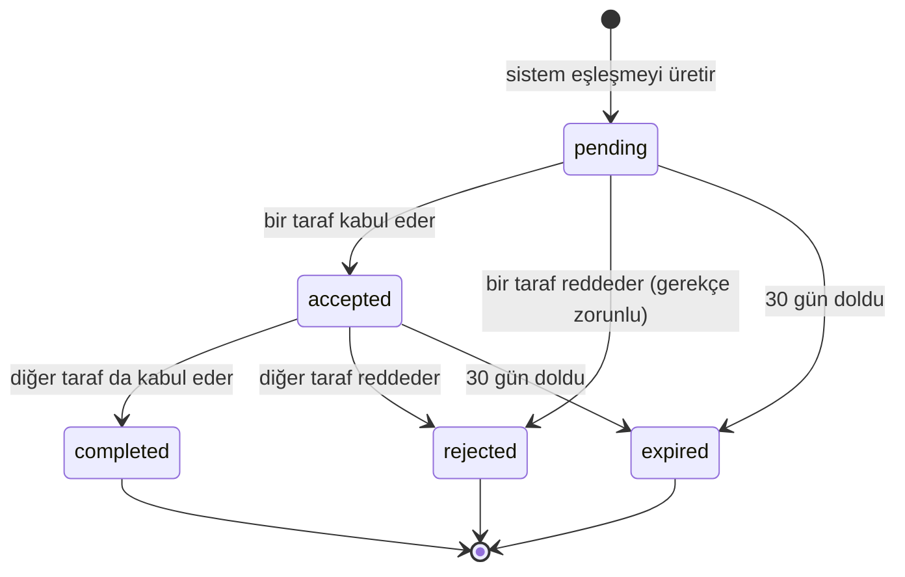

# 05 · İş Kuralları

Bu dosya sistemin "neyi neden hesapladığı"nı tanımlar. Kodda bir sayı görüp nereden
geldiğini merak ettiğinde buraya bak.

## Sabitler

| Sabit | Değer | Kaynak | Değiştirilebilir mi |
|---|---|---|---|
| Cosine benzerlik eşiği | **0.60** | 105 malzeme + 30 etiketli çift üzerinde ampirik test | `system_config` |
| Uzman onay eşiği | güven **< 0.80** | Risk çözümü (HITL) | `system_config` |
| Skorlama öncesi aday | **20** | | `system_config` |
| Kullanıcıya dönen | **10** | | `system_config` |
| Eşleşme geçerlilik | **30 gün** | | `system_config` |
| Embedding boyutu | **768** | `all-mpnet-base-v2` | Hayır — model değişikliği |
| CBAM karbon fiyatı | **85 EUR/ton CO2e** | AB CBAM 2026 tarifesi | `carbon_factors` |

> Eski diyagramlarda benzerlik eşiği **0.65** yazıyor. Yanlıştır. Ampirik testte 0.60 hem
> yanlış pozitifi düşük tuttu hem anlamlı eşleşmeleri kaçırmadı. Bkz.
> [09-kararlar.md](09-kararlar.md) K-01.

---

## Eşleştirme akışı

```
1. Çıktının vektörünü al                     embeddings
2. pgvector HNSW ile aday bul                cosine ≥ 0.60, farklı tesis, LIMIT 20
3. Her aday için mesafe hesapla              PostGIS ST_Distance
4. Aktif ağırlıkları oku                     weights_config WHERE active
5. 5 faktörü hesapla, ağırlıkla topla        0-100
6. CBAM etkisini hesapla                     carbon_factors
7. Skora göre sırala, ilk 10'u al
8. matches tablosuna yaz (status='pending')
```

Adım 2'nin SQL'i [03-veri-modeli.md](03-veri-modeli.md) sonunda.

### Filtreler — aday havuzuna kim girmez

| Kural | Sebep |
|---|---|
| Aynı tesisin girdisi | Self-match (E1) |
| `inputs.active = false` | İhtiyaç karşılanmış |
| Tesis `verified = false` | Doğrulanmamış tesis eşleşemez |
| Çıktı `pending_review = true` | Sınıfı henüz belirsiz (A2) |
| Çıktı `embedding_pending = true` | Vektörü yok, aranamaz (H1) |
| Çıktı `availability = false` | Stok yetersiz (I1) |
| `similarity < 0.60` | Anlamsal olarak yeterince yakın değil |

---

## 5 faktörlü skorlama

Toplam skor 0-100 arası tam sayı:

```
totalScore = round(
    material      × w.material       +
    quality       × w.quality        +
    environmental × w.environmental  +
    logistics     × w.logistics      +
    economic      × w.economic
)
```

Her faktör kendi içinde 0-100'dür. Ağırlıklar **her istekte** `weights_config` tablosundan
okunur; kodda sabit değildir (AD2 kalibrasyonu deploy gerektirmesin diye).

Varsayılan ağırlıklar (v1):

| Faktör | Ağırlık | Neyi ölçer |
|---|---|---|
| Malzeme | **0.30** | Anlamsal uyum + miktar örtüşmesi |
| Kalite | **0.20** | Kompozisyonun aranan spesifikasyonu karşılaması |
| Çevresel | **0.20** | Önlenen CO2 |
| Lojistik | **0.15** | Mesafe |
| Ekonomik | **0.15** | Maliyet avantajı |

### Malzeme skoru (30%)

Anlamsal benzerlikten türetilir, miktar uyumsuzluğuyla cezalandırılır.

```
similarityScore = ((similarity - 0.60) / 0.40) × 100      // 0.60→0, 1.00→100
quantityRatio   = min(supply, demand) / max(supply, demand)

materialScore   = similarityScore - (quantityRatio < 0.20 ? 30 : 0)
```

Eşiği yeniden ölçekliyoruz çünkü ham cosine 0.60-1.00 aralığında sıkışık; kullanıcıya
"0.63 benzerlik" demek anlamsız, "%8 uyum" da yanıltıcı olurdu.

**Kısmi eşleşme (E2):** `quantityRatio < 0.20` ise 30 puan ceza uygulanır ama eşleşme
**elenmez**. UI "Bu tesisin ihtiyacının %16'sını karşılayabilirsiniz" rozeti gösterir.
800 kg arz, 5000 kg talep → ratio 0.16 → kısmi eşleşme.

### Kalite skoru (20%)

`inputs.specs` içindeki her kriterin `outputs.composition` tarafından karşılanma oranı.

```
karşılanan kriter sayısı / toplam kriter sayısı × 100
```

`specs` boşsa (alıcı özel bir şart koymamışsa) skor **70** kabul edilir — bilinmezliği
ne ödüllendirir ne cezalandırır.

### Çevresel skor (20%)

Önlenen CO2'nun, birincil hammadde emisyonuna oranı.

```
netReduction  = virginFactor - secondaryFactor          // kg CO2e / kg
environmental = (netReduction / virginFactor) × 100
```

Faktörler `carbon_factors` tablosundan, malzeme sınıfına göre okunur.

### Lojistik skoru (15%)

Mesafe arttıkça doğrusal düşer, 250 km'de sıfırlanır.

```
logistics = max(0, 100 - (distanceKm / 250) × 100)
```

**Konum yoksa `logistics = 0`** — hata değil, ceza (E6). UI'de "karşı tesis konumu
bilinmiyor" uyarısı gösterilir. Bu, konumunu girmiş tesisleri doğal olarak öne çıkarır.

### Ekonomik skor (15%)

Alıcının birincil hammadde yerine bu malzemeyi alarak elde ettiği tasarrufun, nakliye
maliyeti düşüldükten sonraki net oranı.

```
grossSaving = (virginPrice - secondaryPrice) × matchedQty
transport   = distanceKm × matchedQty × TRANSPORT_COST_PER_KG_KM
economic    = clamp(0, 100, (grossSaving - transport) / grossSaving × 100)
```

> **Kalibrasyon notu:** kalite, çevresel ve ekonomik faktörlerin formülleri kaynak
> belgelerde tanımlı değildi; burada önerildiler. İlk 50 tamamlanmış eşleşmeden sonra
> AHP kalibrasyonuyla (AD2) gözden geçirilmeleri gerekiyor. Malzeme fiyat referansları
> MVP'de sabit tablo; ileride piyasa verisine bağlanabilir.

### Skor renk kodları (UI sözleşmesi)

| Aralık | Renk | Anlam |
|---|---|---|
| ≥ 76 | Yeşil | Güçlü eşleşme |
| 60-75 | Sarı | Değerlendirilebilir |
| < 60 | Gri | Listede gösterilmez |

---

## Eşleşme durum makinesi



| Geçiş | Yan etki |
|---|---|
| → `accepted` | Karşı tarafa `match_pending_your_approval` bildirimi; `audit_log` |
| → `completed` | İletişim bilgileri açılır · `outputs.stock` düşülür · çevresel rapor üretilir · iki tarafa `match_completed` |
| → `rejected` | Karşı tarafa `match_rejected` (**sadece kategori**) · gerekçe AI geri bildirim setine |
| → `expired` | Gece 03:00 cron · iki tarafa `match_expired` |

`rejected` ve `expired` **terminaldir**. Expired bir eşleşme için `POST /retry` yeni bir
kayıt açar; eski kayıt audit izi olarak kalır (A3).

Stok yarışı (E7): `completed`'e geçerken `SELECT ... FOR UPDATE` ile output kilitlenir.
Stok yetmiyorsa `409 INSUFFICIENT_STOCK` — "başkası önce kabul etti".

---

## Human-in-the-Loop (HITL)

AI güven skoru **< 0.80** olduğunda sistem tahmin etmez, uzmana sorar.

### Tetiklenme

```
classify() → confidence < 0.80
  ├─ outputs.material_class = NULL
  ├─ outputs.pending_review = true
  ├─ human_review_queue INSERT (ai_suggestion = top-3)
  └─ expert rolündeki kullanıcılara "review_required" bildirimi
```

`pending_review = true` iken çıktı eşleştirmeye girmez;
`GET /v1/matches/find/:id` **202** döner (A2).

### Uzman kararı

| Aksiyon | Sonuç |
|---|---|
| Onayla | `material_class` set edilir · `pending_review = false` · embedding yeni sınıfla yeniden hesaplanır · kullanıcıya `classification_approved` |
| Reddet | Çıktı kullanıcıya iade edilir, açıklamayı yeniden yazması istenir |

Her karar `training/human_reviewed.jsonl` dosyasına yazılır:
`{text, ai_prediction, ai_confidence, human_label, notes}` — haftalık olarak AI ekibine gider.

### SLA

| Bekleme | Aksiyon |
|---|---|
| 0-24 saat | Normal — uzmana günlük özet e-postası |
| 24-48 saat | Uyarı — uzmana "SLA riski", admin'e kopya |
| 48+ saat | Acil — kullanıcıya "biraz gecikti", admin'e eskalasyon |
| 72+ saat | **Fallback:** AI'ın en yüksek güvenli tahmini otomatik uygulanır, kullanıcıya "otomatik atandı" bildirimi |

72 saatlik fallback önemli: uzman müsait değilse kullanıcı süresiz bloke olmamalı.

---

## CBAM hesabı

CBAM, AB'ye ihracatta karbon içeriği üzerinden alınan sınır vergisi. Döngüsel malzeme
kullanmak bu vergiyi düşürür — hesapladığımız şey bu farktır.

### Formül

```
netReduction    = virginFactor - secondaryFactor        // kg CO2e / kg malzeme
totalCO2Saved   = netReduction × quantityKg             // kg CO2e
cbamSavingEUR   = (totalCO2Saved / 1000) × carbonPrice  // ton × EUR/ton
```

Faktörler `carbon_factors` tablosundan, **rapor üretildiği andaki** geçerli kayıtlarla:

```sql
WHERE material_class = $1
  AND valid_from <= NOW()
  AND (valid_to IS NULL OR valid_to > NOW())
```

### Örnek — organik atık, aylık 24 ton

| Kalem | Değer |
|---|---|
| Birincil hammadde emisyonu | 1,85 kg CO2e / kg |
| İkincil (döngüsel) emisyon | 0,42 kg CO2e / kg |
| **Net tasarruf** | **1,43 kg CO2e / kg** |
| Aylık miktar | 24.000 kg |
| **Aylık CO2 tasarrufu** | **34.320 kg CO2e = 34,32 ton** |
| Karbon fiyatı | 85 EUR / ton |
| **Aylık CBAM tasarrufu** | **2.917 EUR** |
| **Yıllık tahmini** | **~35.000 EUR** |

> **Birim tuzağı:** `carbon_factors.co2_per_kg` **kg CO2e / kg malzeme** cinsindendir
> (organik için 1,85). Kaynak raporda aynı değer ton başına yazılmıştı (1.850 kg CO2e/ton).
> Aynı sayı, farklı birim. Koda her zaman kg-başına gir.

### Retroaktiflik yok

Rapor üretildikten sonra karbon faktörü değişse bile o rapor **değişmez**. Hesaplanan
değerler `reports.data` içinde donar. Yeni rapor istenirse yeni faktörlerle üretilir (AD3).

Bunun sebebi denetlenebilirlik: tesis raporu Bakanlığa veya AB müşterisine gönderdikten
sonra sayının değişmesi kabul edilemez. Her raporda hesaplama kaynağı (`Ecoinvent v3.10`)
ve tarihi yazar.

---

## DPP — Dijital Ürün Pasaportu

Her `output` kaydı bir DPP üretir. ESPR uyumlu JSON + PDF + QR kod.

### Yapı

```jsonc
{
  "dpp_version": "1.0",
  "passport_id": "abc123",
  "product_id": "DOKU-2026-08-800",
  "issuer": {
    "facility_name": "Doku Tekstil A.Ş.",
    "tax_id": "1234567890",
    "location": { "lat": 40.19, "lng": 29.02, "osb": "Bursa Nilüfer OSB" }
  },
  "material": {
    "class": "organic",
    "description": "Tekstil boyahanesi çıkışı arıtma çamuru",
    "composition": { "selüloz": 60, "su": 30, "diğer": 10 },
    "quantity_kg": 800,
    "hazardous": false
  },
  "physical_properties": { "state": "solid", "moisture_percent": 65, "density_kg_m3": 1200 },
  "origin": {
    "process": "textile_dyeing_wastewater_treatment",
    "production_date": "2026-08-15",
    "batch": "B-2026-08-15-001"
  },
  "environmental_impact": {
    "co2_footprint_kg": 0.42,
    "assessment_method": "ISO 14040 LCA",
    "source": "Ecoinvent v3.10"
  },
  "traceability": { "created_at": "...", "updated_at": "...", "chain_of_custody": [] },
  "compliance": { "espr_compliant": true, "cbam_ready": true, "certifications": ["ISO 14001"] },
  "signature": { "algorithm": "HMAC-SHA256", "value": "..." }
}
```

### ESPR uyum kontrolü

`dpp_compliant` şu kontrollerin hepsi geçerse `true`:

| Kontrol | Hata kodu |
|---|---|
| Kompozisyon toplamı = 100 | `composition_sum_invalid` |
| `material_class` NULL değil | `material_class_missing` |
| Üretici konumu var | `issuer_location_missing` |
| Üretim tarihi var | `production_date_missing` |

Başarısız kontroller `compliance.issues[]` dizisine yazılır ve QR tarama ekranında
kırmızı bant gösterilir: "Bu DPP tam ESPR uyumlu değil" (E8). Pasaport yine de üretilir —
engellemek yerine işaretliyoruz.

### QR ve imza

QR kod şu URL'i taşır:

```
https://<domain>/dpp/<passport_id>?sig=<HMAC-SHA256>
```

İmza, `passport_id` üzerinden sunucu gizli anahtarıyla üretilir. Public DPP
endpoint'leri (`/v1/materials/passport/:id/json|pdf`) kimlik istemez ama imzayı doğrular.
Böylece sahada QR tarayan bir çalışan giriş yapmadan doğrulama yapabilir (A5), ama
pasaport ID'lerini tarayarak veri toplamak mümkün olmaz.

---

## Birim standardizasyonu

**DB'deki her miktar kilogramdır.** İstisna yok.

| Katman | Sorumluluk |
|---|---|
| Frontend form | Kullanıcı birim seçer (kg / ton / m³), **kg'a çevirip gönderir** |
| Frontend gösterim | Kullanıcının tercih ettiği birimde gösterir |
| Backend | Sadece kg kabul eder, kg saklar |

Sıvı ve hacimsel malzemede yoğunluk (`density_kg_m3`) zorunludur; m³ → kg dönüşümü
onsuz yapılamaz. Frontend yoğunluk yoksa submit'i engeller (E4).

---

## OSB dashboard KPI'ları

| KPI | Formül |
|---|---|
| Toplam tesis | `COUNT(facilities WHERE osb_id = X AND verified = true)` |
| Aktif eşleşme | `COUNT(matches WHERE status='completed' AND tesis ∈ OSB AND son 30 gün)` |
| Aylık CO2 tasarrufu | `SUM(matches.co2_saved WHERE tesis ∈ OSB AND bu ay)` |
| CBAM tasarrufu | `SUM(matches.cbam_impact WHERE ...)` |
| **Simbiyoz oranı** | `completed / (completed + rejected + expired)` |
| Ortalama eşleştirme süresi | `AVG(accepted_by_consumer_at - created_at)` |

Simbiyoz oranı bölgenin başarı göstergesidir ve Bakanlık raporunun ana metriğidir.
Payda `pending` içermez — henüz karar verilmemiş eşleşmeler oranı bozmasın diye.

---

## Gizlilik kuralları

| Aşama | Karşı taraf hakkında görünen |
|---|---|
| `pending` · `accepted` | OSB adı, sektör etiketi, yaklaşık konum, mesafe |
| `completed` | Firma adı, yetkili kişi, telefon, e-posta |

Tesis adı bile kabul öncesi gizlidir; UI genel bir etiket gösterir:
"Ankara OSB'de bir yapı malzemeleri fabrikası" (S3).

Sebep basit: eşleşme listesi bir tesis dizinine dönüşmemeli. Kullanıcı eşleşmeleri
tarayıp rakip istihbaratı toplayamamalı.
