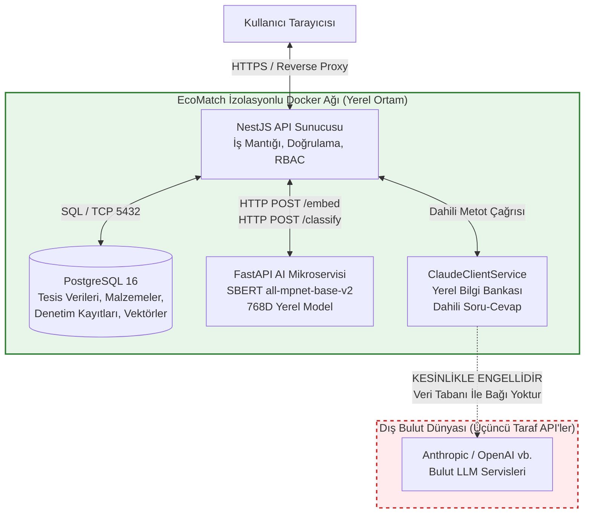

# Bölüm 15: Yapay Zekâ Beyanı ve Veri Sınırı Güvencesi

> **Belge No:** EM-AI-2026-V1  
> **Yarışma:** TEKNOFEST 2026 — Sıfır Atık ve Döngüsel Ekonomi  
> **Takım:** VectorMatch (#1003771)  
> **İlgili Şartname Maddesi:** Madde 10.5 (Yapay Zekâ Beyanı)  
> **Kapsam:** Kullanılan YZ modelleri, veri sınırı güvencesi, sentetik eğitim verisi ifşası, model metrikleri ve yanlılık analizi.

---

## 1. Kullanılan Yapay Zekâ Teknolojileri Envanteri

EcoMatch platformunda kullanılan tüm yapay zekâ, makine öğrenmesi ve doğal dil işleme bileşenleri aşağıda listelenmiştir:

| Bileşen / Görev | Kullanılan Model / Mimari | Çalışma Ortamı | Lisans | Temel Fonksiyon |
|---|---|---|---|---|
| **Anlamsal Vektörleştirme** | `sentence-transformers/all-mpnet-base-v2` | Yerel (Docker CPU) | Apache-2.0 | Malzeme metinlerinden 768 boyutlu yoğun (dense) vektör üretimi. |
| **İnce Ayarlı Eşleştirme (Fine-Tuned)** | Fine-Tuned SBERT (`fine_tuned_model/`) | Yerel (Docker CPU) | Apache-2.0 | 462 atık-hammadde çiftiyle CosineSimilarityLoss kullanılarak eğitilmiş özel eşleştirme modeli. |
| **Atık Sınıflandırma** | Prototip Tabanlı SBERT (7 Kategori) | Yerel (Docker CPU) | Apache-2.0 | Malzeme açıklamasından 7 temel atık kategorisini ve güven skorunu tespit etme. |
| **Hibrit Arama Motoru** | BM25 + SBERT Hibrit ($\alpha = 0.1$) | Yerel (Docker CPU) | Apache-2.0 | Kelime bazlı ve anlamsal benzerliğin ağırlıklandırılmış kombinasyonu. |
| **Vektör Veritabanı** | PostgreSQL 16 + pgvector (HNSW) | Yerel (Docker DB) | PostgreSQL | 768D kosinüs benzerliği üzerinden logaritmik hızlı indeksleme. |
| **Asistan / Chatbot** | Yerel Soru-Cevap Motoru (`ClaudeClientService`) | Yerel (NestJS) | Dahili Kod | Kullanıcı sorularına (DPP, CBAM, eşleştirme) yerel kütüphaneden güvenli rehberlik. |

---

## 2. Veri Sınırı ve Bakanlık Verisi Güvenlik Mimarisi (Claude API Sınırı)

### 2.1. Temel İlke ve Taahhüt
Şartname Madde 10.5'te yer alan *"Bakanlık verileri ve kamuya açık olmayan kurumsal veriler izinsiz üçüncü taraf yapay zekâ servislerine yüklenemez"* kuralı, EcoMatch mimarisinde **fiziksel ve mantıksal veri sınırı izolasyonu** ile %100 güvence altına alınmıştır:

> [!IMPORTANT]
> **SIFIR DIŞ VERİ AKTARIMI TAAHHÜDÜ:**  
> EcoMatch platformunda çalışan yapay zekâ eşleştirme, sınıflandırma ve embedding motorları tamamen yerel Docker konteynerleri içinde çalışır; **dış dünyaya hiçbir veri göndermez.**  
> Chatbot modülü ise üçüncü taraf bir bulut servisine bağlanmak yerine, platformun kaynak kodunda yerleşik olarak bulunan deterministik ve yerel bilgi tabanı üzerinden yanıt üretmektedir. Hiçbir tesis verisi, atık miktarı veya bakanlık bilgisi dışarı sızamaz.

### 2.2. Veri Sınırı Mimari Diyagramı

### 2.3. Kod Seviyesinde Doğrulama (Teknik Kanıt)
- **Veritabanı İzolasyonu:** `backend/src/modules/chat/chat.service.ts` dosyası incelendiğinde; servisin Prisma veya veritabanı bağlantısına sahip olmadığı, gelen isteğin sadece kullanıcının anlık metin mesajından (`message`) oluştuğu görülür.
- **Yerel Yanıt Sağlayıcı:** `backend/src/modules/chat/claude-client.service.ts` dosyasında yanıtlar `CANNED_TOPICS` sabit dizisinden anahtar kelime eşleştirmesiyle üretilir. Harici HTTP istemcisi (fetch/axios) çağrılmamaktadır.
- **Gelecek Faz Tasarımı:** İleriki fazlarda opsiyonel bir LLM entegrasyonu sağlansa dahi, yalnızca genel mevzuat soruları iletilebilecek; tesis adı, vergi no, atık miktarları veya koordinatlar gibi veriler asla sorgu bağlamına dahil edilmeyecektir.

---

## 3. Eğitim Veri Seti İfşası (`veri.csv`)

EcoMatch projesinin yapay zekâ bileşenlerinin geliştirilmesinde kullanılan `AI Microservice/veri.csv` (602 satır) veri setinin niteliği:

1. **Sentetik Üretim Süreci:**
   - Veri setimiz; büyük dil modelleri (LLM) kullanılarak ve çevre/metalurji/kimya mühendisliği literatüründeki endüstriyel simbiyoz taksonomileri referans alınarak **sentetik olarak üretilmiştir.**
   - Ekibimiz tarafından her satır tek tek incelenmiş, teknik tutarlılık ve malzeme uyumluluğu elden geçirilmiştir.
2. **Veri Setinin Yapısı (602 Satır):**
   - **Bölüm 1 (Sınıflandırma Örnekleri - 140 Satır):** 7 kategori (Metal, Plastik, Organik, Kimyasal, Tekstil, Cam, Kâğıt) için kısa ifadeler, kısaltmalar, karma terimler ve yazım hatalı metinler.
   - **Bölüm 2 (Eşleştirme Çiftleri - 462 Satır):** Endüstriyel simbiyoz uyumlu pozitif çiftler (etiket=1) ve teknik/fiziksel olarak uyumsuz "hard negative" negatif çiftler (etiket=0, gerekçe açıklamalı).
3. **Sentetik Verinin Getirdiği Avantajlar:**
   - Gerçek şirketlere veya OSB tesislerine ait hiçbir ticari sır, tescilli reçete, patent veya KVKK kapsamındaki kişisel veri ifşa edilmemiş veya riske atılmamıştır.
4. **Sınırlılıklar ve Yol Haritası:**
   - Sentetik veri gerçek saha koşullarını ve sektörel argo/jargonu tam olarak yansıtmayabilir. Bu sınırlılığı aşmak adına sistemimiz **İnsan Denetimi (HITL)** ile donatılmıştır ve gerçek OSB pilot fazında (TRL 6-7) saha doğrulaması planlanmıştır.

---

## 4. Model Performansı ve Yanlılık Riski Analizi

### 4.1. Eşleştirme Modeli Performans Metrikleri
212 test çifti üzerinde yapılan bağımsız değerlendirme sonuçları:

| Metrik | Ölçülen Değer | Açıklama |
|---|:---:|---|
| **F1 Skoru** | **0.883** | Optimal karar eşiği olan **0.49** seviyesinde elde edilen harmonik ortalama. |
| **Yanlış Pozitif Oranı (FPR)** | **%5.9** | Birbiriyle uyumsuz atıkların yanlışlıkla eşleştirilme riski (endüstriyel güvenlik için kritik). |
| **Pozitif-Negatif Ayrım Skoru** | **0.675** | Pozitif çiftler ortalaması (0.7351) ile negatif çiftler ortalaması (0.0600) arasındaki mesafe. |
| **Doğruluk (Accuracy)** | **%91.2** | Test kümesindeki genel doğru karar oranı. |

### 4.2. Sınıflandırma Modeli Doğruluk Dağılımı
Farklı metin tiplerinde modelin kategori tahmin başarısı:

| Metin Tipi | Doğruluk | Karşılaşılan Zorluk ve Risk |
|---|:---:|---|
| **Normal Standart İfadeler** | **%92.9** | Net ve teknik tanımlarda model yüksek kararlılık sergiler. |
| **Karma / Çok Bileşenli Metinler** | **%92.9** | Yüzdelik bileşim içeren metinlerde yüksek başarı. |
| **Kısa / Tek Kelimelik Girdiler** | **%82.1** | Bağlam eksikliği nedeniyle hafif doğruluk kaybı. |
| **Yazım Hatalı / Bozuk Metinler** | **%64.3** | OCR veya operatör kaynaklı yazım hatalarında düşüş. |
| **Sektörel Kısaltmalar (Jargon)** | **%46.4** | DKP, HRP, ST52, PEX, PVC gibi spesifik kısaltmalarda bağlamsız zorlanma. |
| **Yanıltıcı / Benzer İsimli Çiftler** | **%12.5** | Yüzeysel benzer (ör. makine yağı vs ayçiçek yağı) ancak endüstriyel olarak zıt atıklar. |
| **Genel Ortalama Başarı** | **%76.4** | Tüm senaryolar genelindeki ortalama doğruluk. |

### 4.3. Yanlılık (Bias) Riskleri ve Azaltma (Mitigation) Stratejileri

1. **Dil ve Terminoloji Yanlılığı:**
   - *Risk:* Temel model (`all-mpnet-base-v2`) çok dilli olsa da ağırlıklı olarak İngilizce ve genel Türkçe literatürle eğitilmiştir; Türk sanayi jargonunu eksik temsil edebilir.
   - *Azaltma:* 462 çiftlik yerel veri setiyle yapılan ince ayar (fine-tuning) sayesinde pozitif-negatif ayrımı 0.012'den 0.675'e yükseltilmiştir.
2. **Kısaltma Hassasiyeti Yanlılığı:**
   - *Risk:* Sanayide yaygın olan teknik kısaltmalarda doğruluk %46.4'e kadar gerilemektedir.
   - *Azaltma:* Giriş metnini AI modeline iletmeden önce genişleten bir "Sektörel Kısaltma Normalizasyon Sözlüğü" yol haritasına eklenmiştir.
3. **Yanıltıcı Benzerlik Riski (False Affinity):**
   - *Risk:* Kelime düzeyinde benzer ancak kimyasal/metalurjik olarak bağdaşmayan atıkların eşleşmesi.
   - *Azaltma:* İkili doğrulama mekanizması: Vektör benzerliği $\ge 0.60$ olsa dahi, 5 faktörlü skorlamada yer alan Malzeme ve Kalite kuralları devreye girerek uyumsuzluğu engeller.

---

## 5. İnsan Denetimi (Human-in-the-Loop - HITL) Güvencesi

Yapay zekânın olası hatalı kararlarını önlemek ve modeli sürekli eğitmek için sistemde zorunlu bir insan denetimi mekanizması kurgulanmıştır:

- **Güven Eşiği Filtresi:** Sınıflandırma güven skoru **$< 0.80$** olan tüm malzemeler otomatik olarak `review_queue` tablosuna alınır ve doğrudan yayına alınmaz.
- **Alan Uzmanı İncelemesi:** HITL Uzmanı panelinde yapay zekânın en olası 3 kategori tahmini olasılıklarıyla gösterilir. Uzman doğru kategoriyi seçerek işlemi onaylar veya reddeder.
- **Sürekli Öğrenme:** Uzman tarafından onaylanan/düzeltilen kayıtlar yapılandırılmış JSONL formatında (`training/human_reviewed.jsonl`) arşivlenir ve modelin bir sonraki sürüm eğitiminde "altın veri" (ground truth) olarak kullanılır.
- **SLA Güvencesi:** 72 saat içinde uzman onayı gelmeyen kayıtlar için sistem yöneticisine eskalasyon bildirimi gönderilir.

---

## 6. Geliştirme Sürecinde Üretken YZ Kullanımı Beyanı

- Kod mimarisinin tasarlanmasında, TypeScript/Python tip tanımlamalarında ve test senaryolarının türetilmesinde yapay zekâ kodlama asistanlarından (Claude Code, Antigravity) destek alınmıştır.
- Üretilen tüm kod blokları, SQL migration dosyaları ve iş kuralları ekibimizce satır satır denetlenmiş, yerel test ortamında doğrulanmış ve takımımızın fikri mülkiyet sorumluluğu altında projeye dahil edilmiştir.
